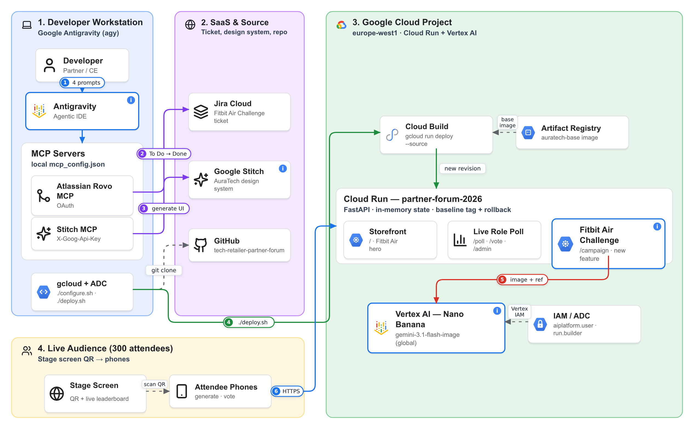

# AuraTech — Antigravity Partner Kit (Jira → Stitch → Cloud Run → Nano Banana)

Brownfield demo for **Google Antigravity**. You start from an existing web app: **AuraTech**, a fictional official Google hardware partner storefront with a Live Role Poll. Antigravity picks up a **Jira ticket**, designs the new feature in **Google Stitch**, waits for your approval, implements it and deploys it to **Cloud Run**. The feature is the *Google Fitbit Air Challenge*, where attendees generate campaign images with **Vertex AI Nano Banana** and vote live.

## Architecture



1. **Developer → Antigravity**: the 4 demo prompts drive the whole session.
2. **Antigravity → Jira Cloud** (Atlassian Rovo MCP): finds your *Google Fitbit Air Challenge* ticket and moves it **To Do → In Progress → Done**.
3. **Antigravity → Google Stitch** (Stitch MCP): generates the campaign screen from the shared AuraTech design system and waits for your approval.
4. **`./deploy.sh` → Cloud Build → Cloud Run**: `gcloud run deploy --source` on the pre-cached base image from Artifact Registry; a new revision serves the Storefront `/`, the Live Role Poll `/poll` and the new `/campaign` (baseline tag + `./rollback.sh`).
5. **Fitbit Air Challenge → Vertex AI Nano Banana** (`gemini-3.1-flash-image`): generates each attendee's campaign image from the official Fitbit Air reference photo, authenticated with the Cloud Run service identity.
6. **Audience phones → Cloud Run** over HTTPS after scanning the QR on the stage screen: generate, vote, live leaderboard.

📎 Session takeaways: [Partner Forum Platform Takeaways](https://docs.google.com/presentation/d/1N0hGiLZYCsasegMNkfARWSR2T4soOZ_k/edit)

> [!IMPORTANT]
> This repo contains **no credentials and no personal identifiers**. Every value that belongs to you is a placeholder:
>
> | Placeholder | What it is | Where you get it |
> |---|---|---|
> | `<YOUR_GCP_PROJECT_ID>` | Your Google Cloud project ID | [Cloud console](https://console.cloud.google.com/) → project picker |
>
> **One command:** `./configure.sh` asks for your GCP project ID, stores it **outside the repo** in `~/.auratech/<repo>.env` and fills the placeholder. Re-run it any time; after a `git reset` it refills without questions.
>
> **Jira and Stitch need no configuration**: Antigravity finds your ticket through your Jira MCP, and the repo already points to the shared Stitch project [`11024850840388252926`](https://stitch.withgoogle.com/projects/11024850840388252926) with its design system `assets/e0fecde15a2549a9b793168efec1fa4f` (AuraTech Minimal Hardware). Ask the owner to share that Stitch project with your Google account.
>
> Antigravity is instructed to **ask you** for any placeholder that is still empty. It never stores tokens or API keys in the repo.

## Prerequisites
- [Google Antigravity](https://antigravity.google/) installed.
- A Google Cloud project with billing enabled, where you can administer Cloud Run, Cloud Build, Artifact Registry, Vertex AI and IAM.
- [gcloud CLI](https://cloud.google.com/sdk/docs/install), `git`, `python3`, and Node.js (for `npx`, used by the Jira MCP).
- A Jira Cloud site where you can create issues.
- A [Google Stitch](https://stitch.withgoogle.com/) account.

```bash
git clone <THIS_REPO_URL> auratech && cd auratech
./configure.sh   # enter your GCP project ID
```

---

## Step 1: Jira MCP (Atlassian Rovo MCP server, OAuth)
Antigravity connects to Jira through the **official Atlassian Rovo MCP server**. You log in with OAuth in your browser, so no API token is stored anywhere.

1. In Antigravity, open **MCP Servers → Manage MCP Servers → View raw config**. This opens `mcp_config.json`.
2. Add this entry inside `mcpServers`:
   ```json
   "atlassian": {
     "command": "npx",
     "args": ["-y", "mcp-remote", "https://mcp.atlassian.com/v2/mcp"]
   }
   ```
3. Save the file and refresh the MCP servers. A browser window opens: sign in to Atlassian, approve the consent screen and select **your** Jira site.
4. If your org restricts AI connectors, ask your Atlassian admin to allow it under **Atlassian Administration → Rovo → Rovo MCP server**.
5. Test it in Antigravity: *"List my Jira projects."*
6. Create the demo ticket. Ask Antigravity:
   > *"Create the Jira ticket described in `docs/JIRA_TICKET.md` in my Jira project and assign it to me."*

   You can also create the ticket manually by copy-pasting [`docs/JIRA_TICKET.md`](docs/JIRA_TICKET.md), and assign it to yourself. No key to configure: Antigravity discovers it.

Official guide: [Get started with the Atlassian Rovo MCP server](https://support.atlassian.com/atlassian-ai-gateway/docs/get-started-with-the-atlassian-remote-mcp-server/).

## Step 2: Stitch MCP
1. Open [stitch.withgoogle.com](https://stitch.withgoogle.com/) → **Settings → API key → Create API key**. Keep the key private.
2. In the same `mcp_config.json`, add:
   ```json
   "stitch": {
     "serverUrl": "https://stitch.googleapis.com/mcp",
     "headers": { "X-Goog-Api-Key": "<YOUR_STITCH_API_KEY>" }
   }
   ```
   Replace `<YOUR_STITCH_API_KEY>` **only in your local `mcp_config.json`**. Never put it in this repo.
3. Refresh the MCP servers and test: *"List my Stitch projects."* You should see the shared project `11024850840388252926` (ask the owner to share it with you if not).

Official guide: [Stitch MCP setup](https://stitch.withgoogle.com/docs/mcp/setup).

## Step 3: Load the repo skills into your workspace
The skills and rules live in the repo and load automatically when the repo folder is your Antigravity workspace:

| Path | Purpose |
|---|---|
| `.agent/rules/auratech-architecture.md` | Workspace rules: Jira lifecycle, Stitch, placeholders, credentials policy |
| `.agent/skills/frontend-skill/` | Stitch design proposal + `campaign.html` implementation |
| `.agent/skills/backend-skill/` | `campaign_router.py` with Nano Banana, voting, in-memory state |
| `.agent/skills/deploy-skill/` | Fast Cloud Run deploy + sign-off + Jira close |

1. In Antigravity: **File → Open Folder** → select the cloned repo.
2. Check it: *"Which skills and rules do you have for this workspace?"* It should list `frontend-skill`, `backend-skill`, `deploy-skill` and `auratech-architecture`.
3. If they don't show up, restart the agent (skills are scanned at startup).

## Step 4: Connect Antigravity to your Google Cloud project (Cloud Run + Nano Banana)
Antigravity runs `gcloud` in its terminal with **your** credentials.

```bash
gcloud auth login
gcloud auth application-default login
gcloud config set project <YOUR_GCP_PROJECT_ID>
./setup.sh                  # one-time: APIs, Artifact Registry, Vertex AI access, pre-cached base image
./scripts/check-cloud.sh    # ✅/❌ checks: account, project, billing, APIs, Cloud Run, real Nano Banana test image
```
If you skipped it at clone time, run `./configure.sh` and enter your GCP project ID (it fills `deploy.sh`, `rollback.sh`, `mark-baseline.sh`, `scripts/check-cloud.sh` and the `Dockerfile`).

Do not continue until `check-cloud.sh` prints **🎉 All checks passed**.

Useful docs: [Cloud Run deploy from source](https://cloud.google.com/run/docs/deploying-source-code) · [Public access / invoker IAM check](https://cloud.google.com/run/docs/securing/managing-access#invoker_check) · [Vertex AI image generation](https://cloud.google.com/vertex-ai/generative-ai/docs/image/overview).

## Step 5: Deploy the existing webpage to Cloud Run (baseline)
The existing storefront and Live Role Poll already live as screens in the shared Stitch project `11024850840388252926`, with the AuraTech design system Antigravity will reuse for the new feature. Nothing to create in Stitch. Ask Antigravity:
> *"Deploy the existing web with `./deploy.sh` and mark it as the baseline with `./mark-baseline.sh`."*

Check the live URL printed by `deploy.sh`:
- `/` shows the storefront with Google Fitbit Air.
- `/poll` shows the Live Role Poll.
- `/campaign` returns **404**. That's expected: the feature doesn't exist yet.

Your GCP project ID lives in `~/.auratech/<repo>.env`, so you never need to commit it. Check it with `./configure.sh --show`.

## Step 6: Generate the new feature from the Jira ticket
In Antigravity:
> *"Do I have any tickets assigned to me?"*

Antigravity finds your "Google Fitbit Air Challenge" ticket, summarises it and asks whether to start. Say yes. It follows the 3-phase lifecycle in `.agent/rules/`:
1. Moves the ticket to **In Progress**, generates the *Google Fitbit Air Challenge* screen in Stitch and **stops for your approval** (Step 7).
2. After approval: builds `campaign_router.py` (Nano Banana with the official Fitbit Air reference image) and `templates/campaign.html`, deploys with `./deploy.sh`, and asks whether you're happy and want to close the ticket.
3. On your confirmation: comments the live URL on the ticket and moves it to **Done**.

## Step 7: Approve the Stitch UI
In Phase 1, Antigravity shows the Stitch render (`stitch_design_proposal.md`) and **waits**. Check:
- The header and nav are identical to the existing web, plus `Fitbit Campaign`.
- The form has blank **Name** and **Company** inputs (no placeholder text), scene chips **Morning Run / Deep Sleep / Office to Gym**, a QR code card and the live leaderboard.

Reply *"approved"*, or ask for changes and it will iterate in Stitch before writing any code.

## Step 8: Personal information & credentials policy
- This repo ships **without** personal information: no Jira tokens, no Stitch API keys or personal project IDs, no personal Google Cloud / demo-environment accounts, project IDs or URLs.
- Credentials live **only** on your machine: in the Antigravity `mcp_config.json` (Stitch API key; the Jira OAuth session is managed by `mcp-remote`) and in `gcloud` (your Google account and ADC).
- Whenever a step needs one of these connections, Antigravity **stops and asks you** to provide your own value, pointing to the matching step above. It never invents IDs and never writes secrets into the repo.
- Before sharing your copy, run a quick check:
  ```bash
  git grep -nE "AIza|AQ\.|ATATT|api[_-]?key\s*[:=]|@[a-z0-9-]+\.(com|net)" || echo "clean"
  ```

---

## Rehearse again (reset to the clean baseline)
```bash
./rollback.sh                                                      # Cloud Run back to the 'baseline' revision (seconds)
git fetch origin && git reset --hard origin/main && git clean -fd  # remove the generated feature files locally
./configure.sh                                                     # refill your values (no questions asked)
```
Then move the Jira ticket back to **To Do**.

## Repository map
| File | Purpose |
|---|---|
| `main.py` | FastAPI: storefront `/`, Live Role Poll `/poll` `/vote` `/admin`, QR `/api/qr`; auto-mounts `campaign_router.py` if present |
| `templates/`, `static/` | Existing UI (`static/images/fitbit-air.png` = official Google Store photo, also the Nano Banana reference) |
| `DESIGN.md` | AuraTech design system (reference copy of the one in the shared Stitch project) |
| `docs/JIRA_TICKET.md` | The ticket Antigravity implements |
| `setup.sh`, `Dockerfile.base`, `cloudbuild.base.yaml` | One-time GCP project setup + pre-cached base image (deploys in ~15–20 s) |
| `deploy.sh`, `mark-baseline.sh`, `rollback.sh` | Deploy, tag the clean baseline, restore it |
| `scripts/check-cloud.sh` | Step 4 connectivity checks |
| `.agent/` | Antigravity rules and skills |

## Local development (optional)
```bash
pip install -r requirements.txt
uvicorn main:app --reload --port 8080
```
